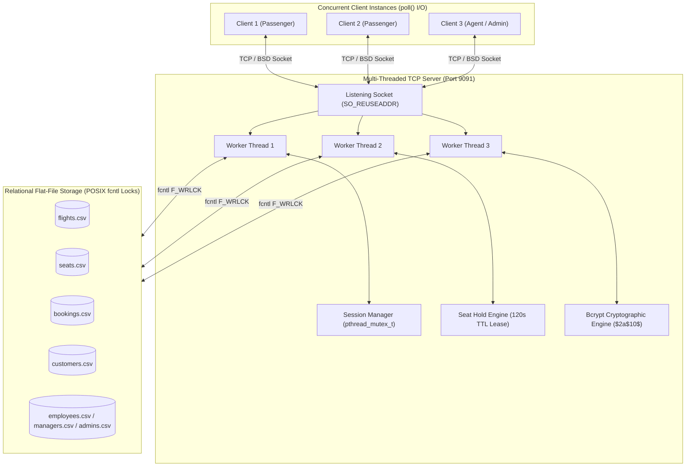
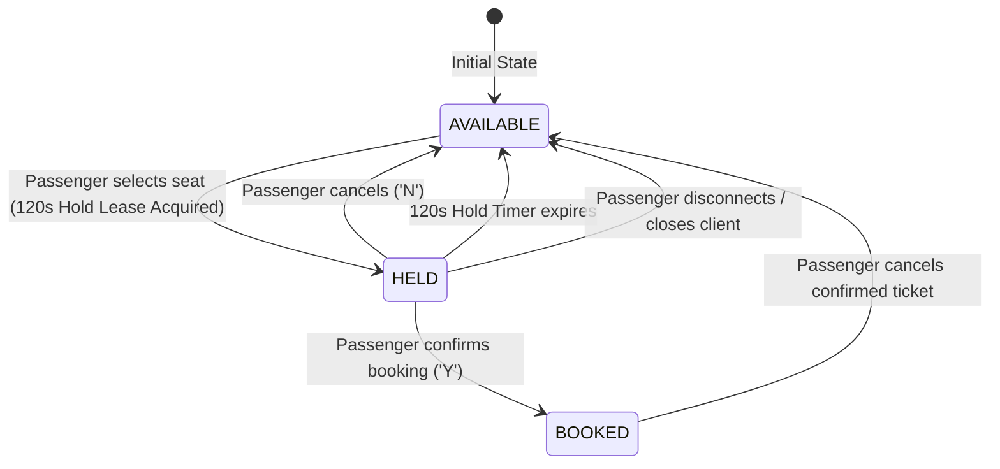

# ✈️ Flight Booking Management System

[](https://en.wikipedia.org/wiki/C11_(C_standard_revision))
[](https://pubs.opengroup.org/onlinepubs/9699919799/)
[](https://en.wikipedia.org/wiki/Berkeley_sockets)
[](https://en.wikipedia.org/wiki/Pthreads)
[](https://en.wikipedia.org/wiki/Bcrypt)

A high-performance, multi-tiered **Flight Booking Management System** built in **C (C11)** using **BSD TCP Sockets**, **POSIX Threads (`pthreads`)**, and **`poll()` I/O Multiplexing**. 

The system features an industry-standard **Real-Time Seat-Level Locking & Reservation Engine with Time-To-Live (TTL) Leases**, transactional flat-file storage with **POSIX `fcntl` advisory locks**, and **Bcrypt one-way salted password hashing** ($2a$10$).

---

## 📑 Table of Contents

- [System Architecture](#-system-architecture)
- [Key Features](#-key-features)
- [Role-Based Access Control (RBAC)](#-role-based-access-control-rbac)
- [Interactive Seat-Level Locking Engine](#-interactive-seat-level-locking-engine)
- [Cryptographic Security (Bcrypt)](#-cryptographic-security-bcrypt)
- [Installation & Quick Start](#-installation--quick-start)
- [Automated Testing Suite](#-automated-testing-suite)
- [Engineering & Design Decisions](#-engineering--design-decisions)
- [Project Directory Structure](#-project-directory-structure)

---

## 🏛 System Architecture



---

## 🌟 Key Features

- **Concurrent Multi-Client Server:** Multithreaded client handling (`pthread_create`, `pthread_detach`) paired with `poll()` based non-blocking I/O multiplexing.
- **Real-Time Seat-Level Locking (Lease with TTL):** Passengers select individual seats (`1A`, `2B`, etc.) on a live visual seat map. Selected seats are temporarily held exclusively for **120 seconds**, preventing race conditions and double bookings.
- **Fault-Tolerant Auto-Release on Disconnect:** If a client crashes or abruptly terminates during checkout, the server catches the disconnect, avoids `SIGPIPE` crashes, immediately frees all active seat holds, and clears the session.
- **Bcrypt Salted Password Hashing:** Replaces plaintext credential storage with self-contained **EksBlowfish Bcrypt** password hashing, generating unique 128-bit random salts per user with constant-time verification.
- **POSIX `fcntl` Concurrency Control:** Flat-file database transactions are protected with file locking and thread mutexes, guaranteeing ACID-like consistency without race conditions.
- **Zero Duplicate Logins:** Real-time session manager prevents simultaneous duplicate logins from multiple endpoints for the same user account.

---

## 👥 Role-Based Access Control (RBAC)

| Feature / Permission | 🛫 Passenger | 👔 Agent | 📊 Manager | 🛡️ Admin |
| :--- | :---: | :---: | :---: | :---: |
| **View Flight Schedules & Seat Availability** | ✅ | ✅ | ✅ | ✅ |
| **View Live Terminal Visual Seat Map** | ✅ | ✅ | — | ✅ |
| **Reserve & Lock Seats (120s Hold Lease)** | ✅ | — | — | — |
| **Book & Cancel Tickets (Auto Seat Refund)** | ✅ | — | — | — |
| **Submit Customer Feedback** | ✅ | — | — | — |
| **Add New Passengers (Unique Check)** | — | ✅ | — | — |
| **Modify Passenger Details** | — | ✅ | — | ✅ |
| **View Passenger Booking History** | My Bookings | All Pax | All Bookings | All Bookings |
| **Toggle Passenger Account Active State** | — | — | ✅ | — |
| **Review Customer Feedback Log** | — | — | ✅ | — |
| **Add Flight Routes & Initialize Seat Map** | — | — | — | ✅ |
| **Add / Manage Agents & System Oversight** | — | — | — | ✅ |
| **Change Account Password (Bcrypt Hashed)** | ✅ | ✅ | ✅ | ✅ |

---

## 💺 Interactive Seat-Level Locking Engine

When a passenger initiates a booking, the server renders a terminal visual seat map and begins an exclusive lease:

```text
======================= FLIGHT 1 SEAT MAP =======================
  Col A      Col B          Col C      Col D
---------------------------------------------------------------
[1A:FREE]  [1B:FREE]      [1C:FREE]  [1D:TAKEN] 
[2A:FREE]  [2B:TAKEN]     [2C:HELD]  [2D:FREE]  
[3A:FREE]  [3B:FREE]      [3C:FREE]  [3D:FREE]  
[4A:FREE]  [4B:FREE]      [4C:FREE]  [4D:FREE]  
[5A:FREE]  [5B:FREE]      [5C:FREE]  [5D:FREE]  
---------------------------------------------------------------
Legend: [FREE] = Available | [HELD] = Reserved (2 min) | [TAKEN] = Booked
===============================================================
```

### Seat State Machine:


---

## 🔒 Cryptographic Security (Bcrypt)

All user credentials across `customers.csv`, `employees.csv`, `managers.csv`, and `admins.csv` are protected using **Bcrypt** ($2a$10$):

```csv
id,username,password,active
1,customer1,$2a$10$B4Zf7oMrDsAHLE1s4u8/IukCbtq2GujtNF3uxruThMYKwtg2V8ey.,1
2,customer2,$2a$10$B4Zf7oMrDsAHLE1s4u8/IukCbtq2GujtNF3uxruThMYKwtg2V8ey.,1
3,alice,$2a$10$4WjDR2k2gsmeQSA5QUbTVeJ1bOldzncYurx63wiiMGQpjY3XJTsgC,1
```

- **Salt Generation:** Unique 128-bit cryptographically secure pseudorandom salt per record from `/dev/urandom`.
- **Work Factor (Cost):** $2^{10} = 1024$ key expansion rounds to defeat GPU/ASIC brute-force and dictionary attacks.
- **Timing-Attack Resistance:** Employs constant-time verification in `bcrypt_checkpw()`.

---

## 🚀 Installation & Quick Start

### Prerequisites
- **Compiler:** GCC or Clang (C11 support)
- **Build Tool:** Make
- **Environment:** POSIX-compliant OS (macOS, Linux, BSD)
- **Testing:** Python 3 (for automated test suites)

### 1. Clone & Build

```bash
git clone https://github.com/Abhi-3009/flight-booking-system.git
cd flight-booking-system
```

### 2. Initialize Database

Seeds mock flights, users, and initializes bcrypt password hashes:
```bash
make setup
```

### 3. Compile Binaries

```bash
make all
```

### 4. Run Server & Client

Open two separate terminal windows:

**Terminal 1 (Server):**
```bash
./server
```

**Terminal 2 (Client):**
```bash
./client
```

---

## 🔑 Default Test Credentials

| Role | Username | Plaintext Password |
| :--- | :--- | :--- |
| **Passenger** | `customer1` *(or `customer2`, `alice`, `bob`)* | `pass123` *(or `alice123`, `bob123`)* |
| **Agent** | `employee1` | `pass123` |
| **Manager** | `manager1` | `pass123` |
| **Admin** | `admin1` | `pass123` |

---

## 🧪 Automated Testing Suite

The repository includes comprehensive automated concurrency and RBAC test suites in Python.

Run all tests with a single command:

```bash
make test
```

### Test Coverage Summary:
- ✅ **Concurrent Seat Locking:** Verifies dual-client simultaneous seat selection and lock contention.
- ✅ **Hold Expiration & Cancellation:** Verifies timeout release and explicit cancellation rollback.
- ✅ **Disconnect Recovery:** Verifies instant hold release upon sudden client socket termination.
- ✅ **Booking Cancellation:** Verifies seat restoration and flight capacity increment.
- ✅ **Bcrypt Authentication:** Verifies password hashing, authentication, and password updates.
- ✅ **RBAC Operations:** Verifies duplicate username prevention, account deactivation, and admin oversight.

---

## 💡 Engineering & Design Decisions

### 1. Why Lease/TTL Locks instead of blocking OS file locks for the 2-minute booking window?
> If an OS-level file lock (`fcntl`) were held for 2 minutes while a user decided on a seat, the entire database file would be locked, freezing the server and preventing all other users from browsing or booking different seats. Instead, the system uses an in-memory **Optimistic Record Hold Lease with a 120s TTL** protected by a microsecond mutex, reserving file locks strictly for millisecond disk writes.

### 2. Why `bcrypt` over plain SHA-256 or MD5?
> General hash functions like SHA-256 are designed for raw speed (e.g., checksumming gigabytes of data). Modern GPUs can compute over 10 billion SHA-256 hashes per second, making dictionary attacks trivial. `bcrypt` incorporates **adaptive key stretching** ($2^{10}$ iterations) and **per-user 128-bit salting**, making brute-force attacks computationally infeasible and immune to Rainbow Table lookups.

### 3. Why `signal(SIGPIPE, SIG_IGN)` and Socket Cleanup Hooks?
> In socket network programming, writing to a closed socket triggers a `SIGPIPE` signal which terminates the server process by default. By ignoring `SIGPIPE` and handling socket `EOF` gracefully in worker threads, the server ensures 100% uptime even during abrupt network disconnects.

---

## 📁 Project Directory Structure

```text
.
├── Makefile                # Build automation, database seeding, and test targets
├── server.c                # Multi-threaded TCP server & connection handling
├── client.c                # Client entry point with poll() I/O multiplexing
├── common.h                # Core structs, constants, and role definitions
├── auth.c / auth.h         # Bcrypt authentication and session registration
├── session_manager.c / .h  # Thread-safe session tracking (duplicate login prevention)
├── seat_manager.c / .h     # Real-time seat map & temporary hold engine (120s TTL)
├── bcrypt.c / bcrypt.h     # Standalone EksBlowfish bcrypt cryptographic engine
├── init_db.c               # Database initialization and bcrypt seed generator
├── customer.c / .h         # Passenger workflows (seat selection, booking, cancel)
├── employee.c / .h         # Agent workflows (passenger creation, modification)
├── manager.c / .h          # Manager workflows (approvals, feedback review)
├── admin.c / .h            # Admin workflows (flight creation, oversight)
├── utils.c / utils.h       # Shared utilities (string trimming, file locking)
├── test_system.py          # End-to-end automated seat-locking test suite
├── test_all_roles.py       # Role management & RBAC test suite
└── data/                   # Flat-file databases (flights, seats, bookings, users)
```

---

## 📄 License

This project is open-source and available under the [MIT License](LICENSE).
